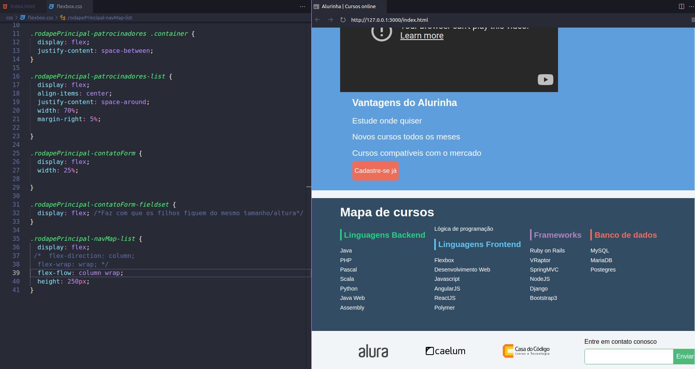

# Curso de Flexbox: posicione elementos na tela

## Faça esse curso de HTML e CSS e:

 - Aprenda a famosa especificação flexible box para posicionar seus elementos na página 
 
 - Entenda as diversas propriedades do flexbox e como usá-las

 - Entenda como as propriedades do flexbox substituem float, inline e inline-block

 - Elabore um site responsivo com flexbox
 
GitHub Pages: 
[Acessem](https://tiagomerc.github.io/Flexbox-posicione-elementos-na-tela/)

### Flexbox: posicione elementos na tela

#### Arrumando cabeçalho 

#### Arrumando o footer 

Posicionando imagens na horizontal e organizando cada elemento de forma adequada. 

#### Arrumando o course map

Organizando o mapa de cursos na horizontal e com os informações dos cursos na vertical. 

Organizando o mapa de cursos na horizontal e com os informações dos cursos na vertical. 

Arrumando os elementos com flexbox para mobile

